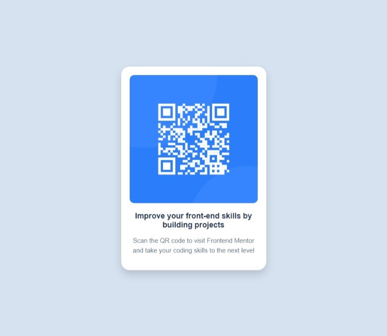

# Frontend Mentor - QR code component solution

This is a solution to the [QR code component challenge on Frontend Mentor](https://www.frontendmentor.io/challenges/qr-code-component-iux_sIO_H). Frontend Mentor challenges help you improve your coding skills by building realistic projects. 

## Table of contents

- [Overview](#overview)
  - [Screenshot](#screenshot)
  - [Links](#links)
- [My process](#my-process)
  - [Built with](#built-with)
  - [What I learned](#what-i-learned)
  - [Useful resources](#useful-resources)
- [Author](#author)

## Overview

This is a simple static webpage displaying a QR code image, text heading, and a short description. 

### Screenshot

### Links

- [Solution URL](https://github.com/thamu-acn/qr-code-component.git)
- [Live site URL](https://thamu-acn.github.io/qr-code-component/)

## My process

- Adding HTML to create structure.
- Adding CSS styles to layout the content

### Built with

- Semantic HTML5 markup
- Flexbox

### What I learned

Applying Flexbox to layout page content.

### Useful resources

- [MDN WEB DOCS](https://developer.mozilla.org/en-US/docs/Web/CSS/CSS_flexible_box_layout/Basic_concepts_of_flexbox) - This helped me for placing the contents at the center of the page.
- [Stackoverflow](https://stackoverflow.com/questions/4394309/how-do-i-fit-an-image-img-inside-a-div-and-keep-the-aspect-ratio) - This helped me to fit the image inside the container div element.

## Author

- Name - Thamsanqa Ndebele
- Frontend Mentor - [@thamu-acn](https://www.frontendmentor.io/profile/thamu-acn)
- LinkedIn - [Thamsanqa Ndebele](https://www.linkedin.com/in/thamsanqa-ndebele-12988487/)

